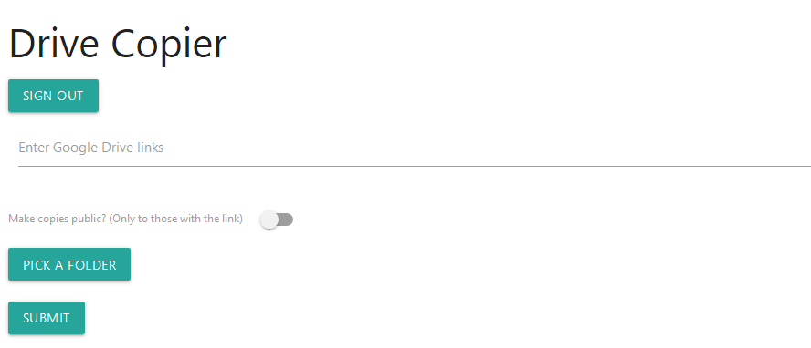
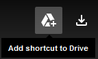
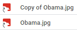
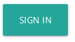
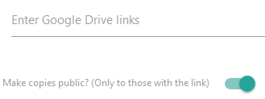
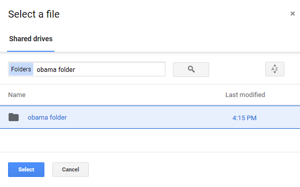
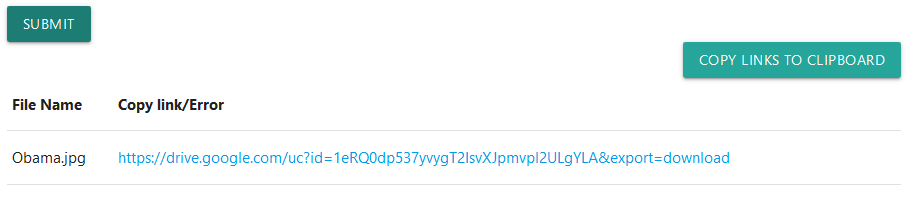

# Drive Copier
Web app to simplify making copies of public Google Drive files and bypass download quotas.\
Also copies folders while preserving folder structure.\
Built with React, Flask and Docker.

[Try it at drivecopier.xyz](https://drivecopier.xyz)



### Why use this over the browser UI?
Back in the old days, when downloading a popular public Google Drive file, users would run in to the daily download
quota.


Bypassing the quota was simple: copy the file and download the copy. But, times have changed and so has Google
Drive. Now, users are only able to "Add shortcut to Drive". 



As the button suggests, it only makes a shortcut to the
original file, NOT add the original to My Drive. To add the cherry on top, selecting "Make a copy" of the
shortcut from My Drive does not make a copy of the original, just a copy of the shortcut.



In a world without a way to download the popular file, Drive Copier aims to provide the now-gone functionality of
"copy the file and download the copy". It even makes copies without prepending "Copy of" to the filename, unlike the old
browser UI.

### Setup
You are going to need the following client credentials to get access to authorization and Google API:
- Client ID
- Client Secret

You can get them from the [Google API Console](https://console.developers.google.com). If running locally, your\
Authorized JavaScript origins should include
```
http://localhost
```
and your Authorized redirect URIs should include
```
http://localhost/callback
```
Then, plug the credentials into the Dockerfile.\
Build and run:
```
docker build -t myimage ./
```
```
docker run -d -p 80:80 myimage
```
Finally, visit http://localhost in your browser.

### Usage
Using Drive Copier is simple. 

#### 1. Sign in and authorize the app.



#### 2. Paste your Google Drive links to copy into the textarea. Check if you want your copies to be public (for download managers like Jdownloader).



#### 3. Pick a destination folder.



#### 4. Submit and the app should spit out the copies or the errors if there were any. 

